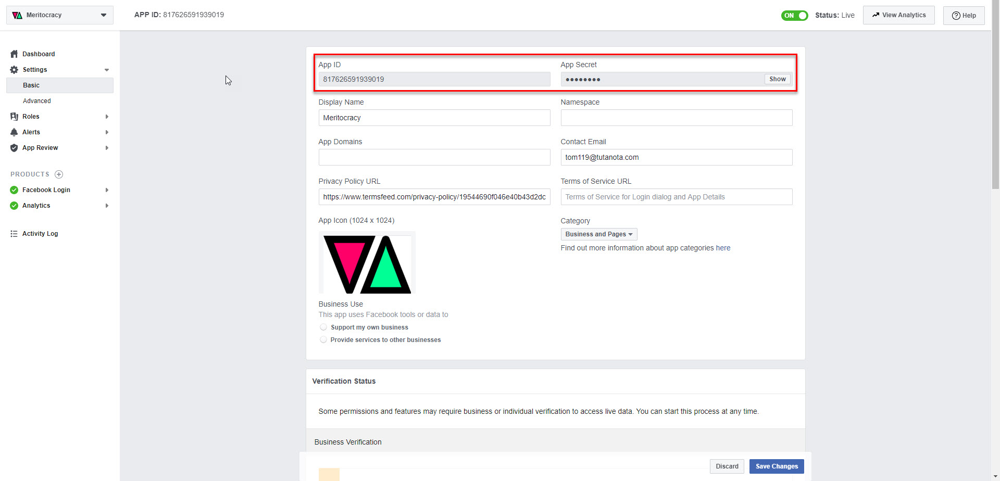
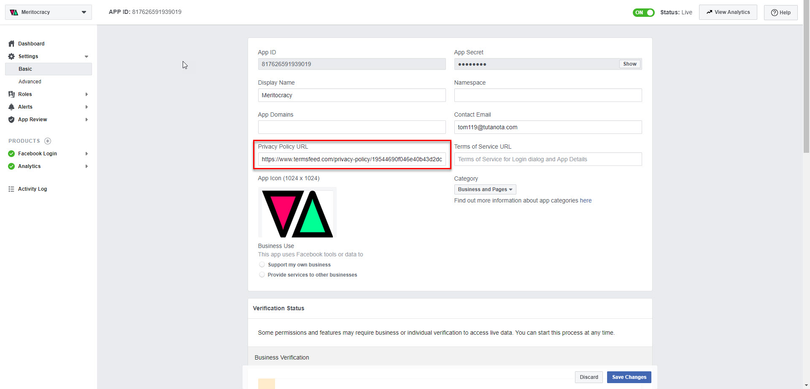
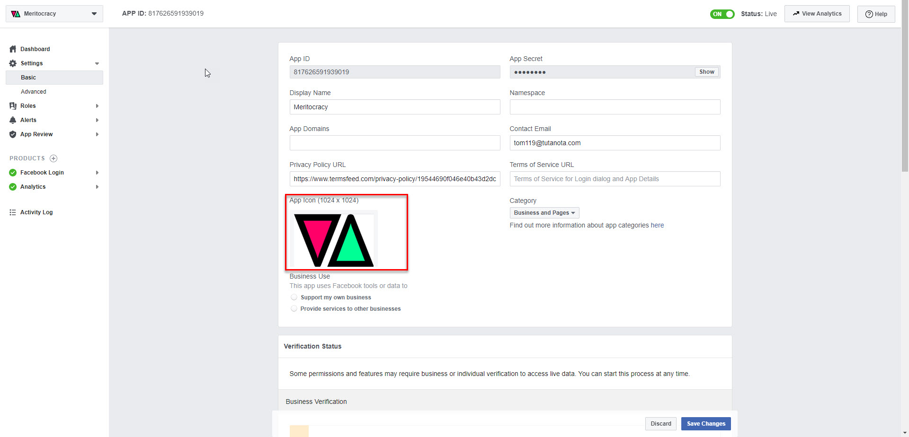
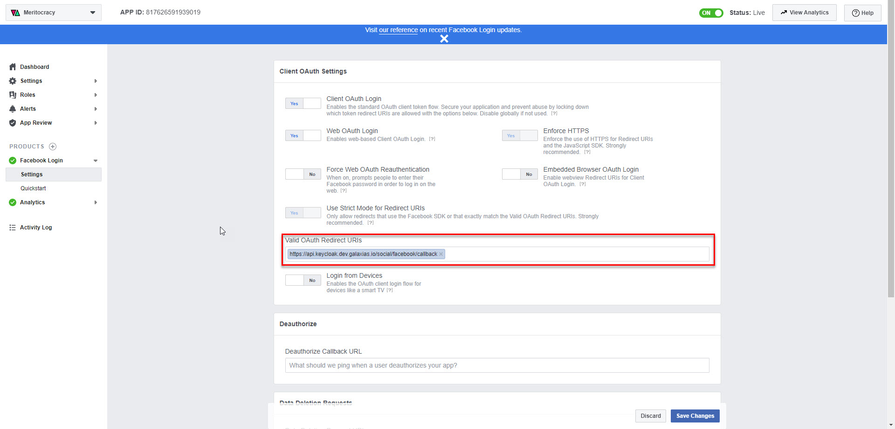
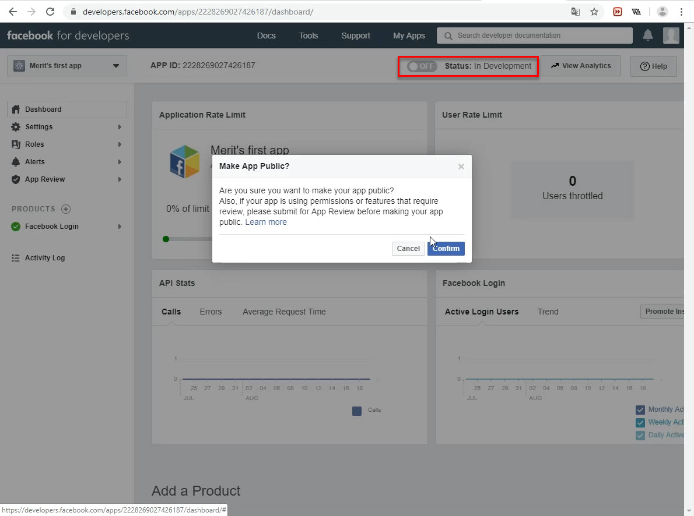
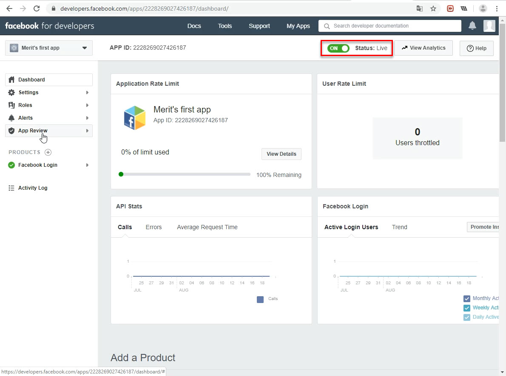

# Create App on Facebook

## Create an App

To start, you need to create a Facebook app, which is an object that represents your actual application and stores settings and information for it.

- Create your developer account, if you don't already have one: [Create Developer Account](https://developers.facebook.com/async/registration/dialog)
- Create a new app and app ID. When you do this, you automatically register the app and generate a new Facebook App ID. For full instructions, see [Create and Register Apps](https://developers.facebook.com/docs/apps/register). [Create New App](https://developers.facebook.com/apps/async/create/platform-setup/dialog/)

Once you complete the wizard, your app appears in [App Dashboard](https://developers.facebook.com/apps). The dashboard is where you can finish setting up your app and where you can make changes to your app's settings, such as adding or deleting ad accounts that can run ads for your app.

## Add App Information

After you create an app, you can go to [App Dashboard](https://developers.facebook.com/apps) and provide all the information and settings for your app. For app ads, make sure you complete the following:

### Provide Core Information

You must provide a `Privacy Policy URL`.

### Specify Platforms

You need to provide platform information for each platform you deliver your app on. For each platform, go to `Settings` > `Basic` and click `Add Platform`.


### Check Availability

Make sure your application is publicly available in the correct app store. Then in App Dashboard, under `App Review` > `Make new app public?`, select `Yes`.


For more details, please check the following docs and screenshots:

- https://developers.facebook.com/docs/app-ads/app-setup/

- `APP_ID` and `APP_SECRET` will be used on backend.


- You can generate your `Privacy Policy URL` from https://www.termsfeed.com


- You can change your App icon by changing image


- This `URI` is used as `callback_url` after Facebook authentication


- Once everything is done, you should change your app mode to `production` mode.



# Configure APP ID and SECRET on Backend

Go to `.env`, you can see `FB_APP_ID` and `FB_APP_SECRET`.

```
{
    ...
    "FB_APP_ID": "...",
    "FB_APP_SECRET": "...",
    ...
}
```

By changing this fields, you can configure Facebook App you created.

